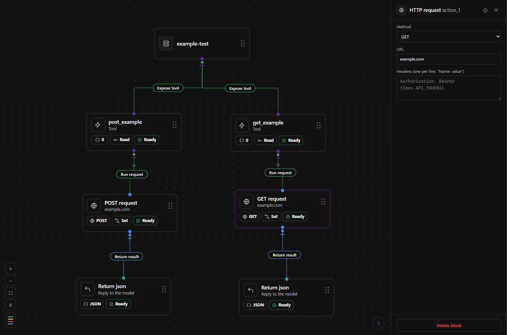
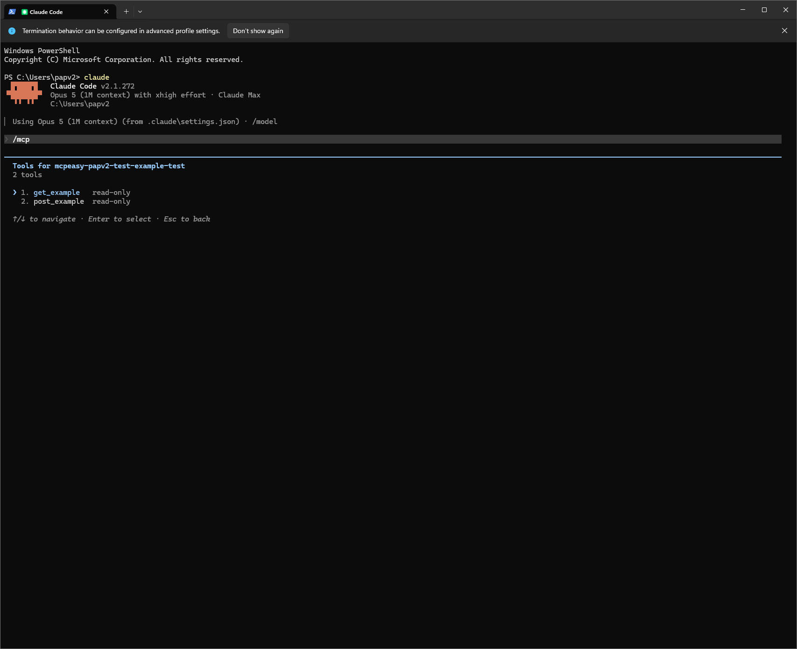

# 

Visual builder for Model Context Protocol servers. A server is designed as a
**graph doc** (JSON) and run by one **engine** everywhere: the in-app test
console, local CLI over stdio, hosted over Streamable HTTP. Code export is a
separate compiler that targets the same engine semantics.

MCPeasy ships as a **packaged desktop app**. Install it, build a server on the
canvas, and connect it to an MCP client from the Integrations page — no
toolchain, no terminal, no repo checkout required.

## What it looks like



A server is a graph. The server node fans out to its tools along **Expose tool**
links; each tool runs its chain downward — here an HTTP request, then a JSON
reply to the model. Each node shows its own summary badges — a tool's input
count and `Read`/`Write` access, an action's method and whether a target URL is
set — ending in a health badge that reads **Ready** only when that node has no
lint errors or warnings.

The links you drag are editor rendering only. Execution follows
`tool.entry` → `node.next`, which is why a tidy-looking canvas can still be
wrong and the lint rules matter.

## Layout

| Path | What |
|---|---|
| `packages/schema` | Graph doc types, zod validation, migrations, the 10 lint rules, JSON Schema projection. Zero runtime deps beyond zod. |
| `packages/engine` | `{{template}}` renderer, transforms, HTTP action (timeout/size cap/private-range guard), chain runner, SDK adapter (`buildServer`), stdio serving. |
| `apps/desktop` | The Electron app: React Flow canvas, properties panel, test console, secrets, Integrations, and headless `--mcp-serve` mode. |
| `apps/cli` | `mcpeasy dev <graph.json>` (stdio server), `mcpeasy lint <graph.json>`. |
| `examples/` | Graph docs usable as starting points. |

## Test before you connect


The test console runs the tool through the **same engine** that serves it over
stdio and HTTP, so a result here is the result a model gets — not an
approximation. Pick a tool, supply inputs, run it.

Two details are worth more than they look. The response pane shows the raw
content the model receives, so an upstream page that returns HTML instead of
JSON is visible immediately rather than at connect time. And **Input schema as
the model sees it** expands the exact JSON Schema projected from the tool's
inputs — including `additionalProperties: false`, which MCPeasy always emits so
a model cannot smuggle undeclared fields into a request.

Secrets typed into this panel are used for that run only and are never written
to the graph doc.

## Connect to Claude Code (from the desktop app)

Open a saved server in the desktop app, go to **Integrations**, and press
**Connect** on a client's tile. A dialog states exactly what will happen —
which file is written, the entry name, the JSON key, and that a backup is taken
first — and asks you to type the server's name to confirm. Nothing is written
until that name matches. Start or restart the client to load the server.

Connecting is the only action on that page that writes outside the workspace,
which is why it asks for the same deliberate confirmation as deleting a server.



Run `/mcp` in Claude Code to confirm it worked. The entry appears under a
generated name — `mcpeasy-<project>-<server>`, built by `entryNameFor()` in
`apps/desktop/src/main/claudeCode.ts` — and that `mcpeasy-` prefix is load
bearing: it is how MCPeasy recognises its own entries and avoids overwriting a
server you registered by hand.

Each tool carries the **read-only** annotation from its node, forwarded as the
MCP `readOnlyHint`. Clients use it to decide what needs a human in the loop, so
a tool that writes must not be left marked read-only — a lint rule flags the
common case where a `get_`/`list_` name disagrees with the annotation.

The registered entry launches **MCPeasy itself in headless serve mode**, not
the CLI. That is what keeps secrets out of the config file: Claude Code's
`${VAR}` expansion resolves from its own environment with no keychain
indirection, so the launched process resolves declared env values from the
encrypted project store instead. The entry holds only a project id and a file
path.

The page blocks the connect and says why when the file cannot be read as a
server document, when it is open in the builder with unsaved changes, when it
declares an env var with no stored secret, or when it uses the `http` transport
(which listens on a port rather than being launched by the client). Lint
warnings do not block a connect — they are advice, and the canvas is where you
see them.

## Try it in Claude Desktop (still manual)

Claude Desktop has no MCPeasy registration flow yet — it remains a hand-edited
config. Add to `claude_desktop_config.json` (Windows: `%APPDATA%\Claude\`),
pointing `command` at the installed MCPeasy executable:

```json
{
  "mcpServers": {
    "mcpeasy-echo": {
      "command": "C:/Program Files/MCPeasy/MCPeasy.exe",
      "args": ["--mcp-serve", "--project", "<project-id>", "--server", "<path-to-server.json>"]
    }
  }
}
```

This is the same headless serve invocation the Integrations page writes for
Claude Code, so secrets stay in the encrypted project store rather than the
config file. Restart Claude Desktop, then ask it to "echo the message hello".

## Invariants worth knowing before editing

- **Execution lives in `tool.entry` → `node.next` chains.** `edges`/`layout`
  are editor rendering only; the engine never reads them.
- **`{{input.x}} {{env.Y}} {{prev.z}}` is the entire dynamic surface.** No
  expressions, no code, until sandboxing is proven (design decision #5).
- **stdout is sacred in stdio mode.** All logging goes to stderr; one stray
  `console.log` corrupts the JSON-RPC stream.
- **Graph docs never contain secret values** — env var *names* only.
- **A client config written by MCPeasy never contains a secret value.** The
  registered command launches the app in headless serve mode, which decrypts
  declared env values through OS `safeStorage` inside its own process. Writing
  a value into a client config would also contradict the fail-closed rule in
  `apps/desktop/src/main/secrets.ts`, which refuses plaintext on disk.
- **Claude Code's `~/.claude.json` is merged, never replaced.** It holds the
  user's OAuth session and per-project trust decisions, so every MCPeasy write
  backs it up first, writes atomically, and refuses outright when the file
  cannot be parsed.
- **Additive schema changes only**, with a migration step per version bump.
- Upstream HTTP error bodies are never echoed into tool errors (status code
  only) so secrets can't leak into model-visible text.
